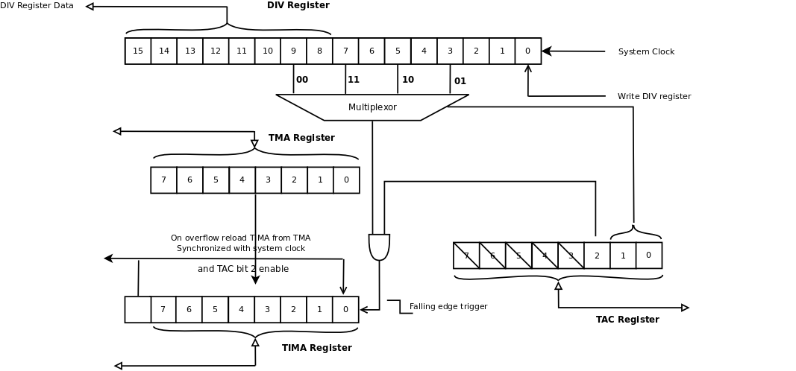

## Timer

The timer register on the Game Boy seems to cause many people problems. The register is 16 bits long and incremented every 4.096Mhz (or 8.192Mhz double speed), the register can only be read, any writes to the register clear it. Whenever a selected bit in register transitions for 1 to 0 it triggers the operation.

Every system clock the DIV register is incremented. At reset this register is set to 0. The DIV register will increment by 4 for every CPU cycle. The upper 8 bits of the DIV register can be read by the CPU at any time. The TAC register is only 3 bits wide (all other bits are ignored and return 1). The lower two bits select which bit of DIV register will control incrementing of the TIMA register. When TAC register bit 2 is set and the selected bit both go to zero the TIMA register will be incremented. So if the selected bit is 1 and the timer is turned off by writing 0 to bit 2 of the TAC, the timer will increment. Whenever the DIV register is written and the selected bit in the DIV register is set the TIMA register will increment.

When the TIMA register is incremented past 0xff there is a hidden bit that is set to indicate overflow. When overflow is set this will trigger and interrupt. Also at the next system clock pulse the TIMA register will be reloaded from the TMA register. If the timer has overflow bit set and the TMA register is written the data will come from TIMA rather then the CPU. If the timer is has overflow set and the TIMA register is updated the TIMA register will be loaded with TMA register rather then CPU data.

Not shown in the diagram is there is a tap off the DIV register from bit 12 (or 13 for double speed) that provides the 512Hz signal that is needed to handle APU frames. The update of the APU frame also occurs when the DIV register transitions from 1 to 0.